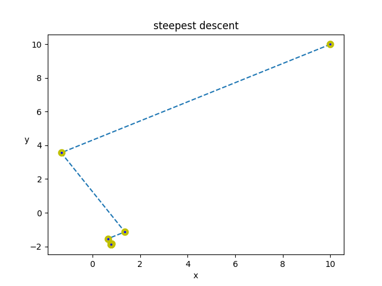
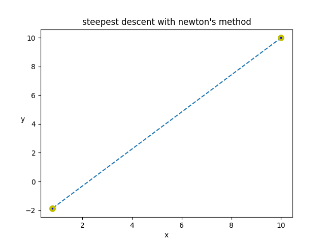
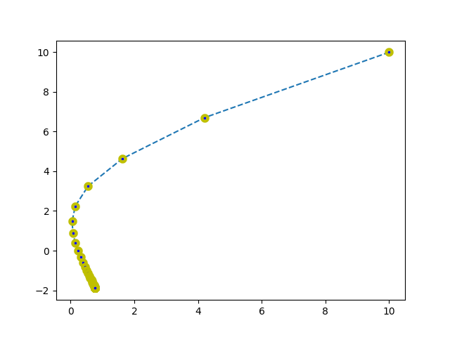
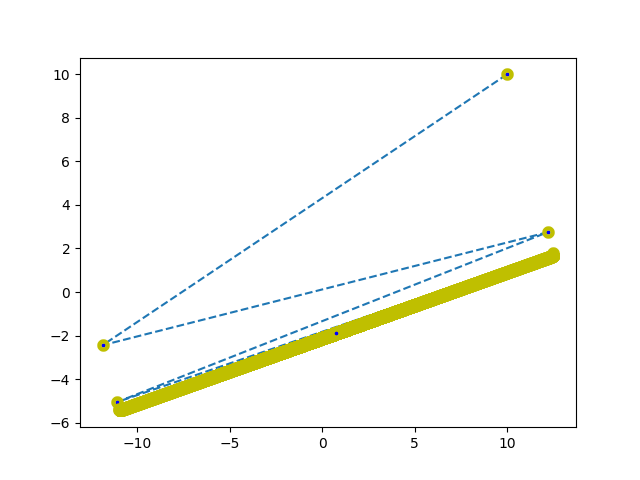

 

 

 

 

# Optimization-SteepestDescent vs GradientDescent
<h3>Understand working of Steepest-Descent and Gradient-Descent methods</h3>
<h4>We will work with Quadratic function. Because any higher dimension will be harder to plot and visualize.</h4>

<h2>Problem Statement :-</h1>

`Q = np.array([[5,1], [1, 2]])`

`b = np.array([[-2], [3]])`

`c = 10`

`x = np.array([[10], [10]])`

 `cost_func_f(x) = (1/2)*x.T*Q*x + b.T*x + c` or `(5/2)* (X2**2)+(Y2**2)+X2*Y2-2*X2+3*Y2+10`
 
 Find point `x` s.t. `cost_func_f(x)` is minimum.

## Different Approaches: 
 * Steepest Descent
 * Gradient Descent

Below we will see demo of these:-

## 1.Steepest Descent: 
> In this learning rate or step size is determined based on algorithm and is not a heuristic value.

<h4> a) Base problem </h4>
<h6>Steepest Descent Method also known as <a href="https://en.wikipedia.org/wiki/Saddle_point" target="_blank">saddle</a> method. In this we move in a direction untill the cost function stops decreasing [i.e. ∇f(dx1)=0, where dx1 is that direction. Cost function may still decrease in other direction]. Then we pick another direction let say dx2. In this each next direction is perpendicular to last direction ( dx1 ⊥ dx2 ). The saddle points are point of contact to the <a href="https://en.wikipedia.org/wiki/Contour_line" target="_blank">contour line</a> where that direction is tangent.</h6>

 

<h4> b) Steepest Descent with Newton's Method </h4>
<h6>In newton's method we approximate our cost function with a similar quadratic equation which behaves similar to our original function in some small neigbourhood. It then tries to find the optiamal pt of that quadratic function. It repeats this process untill stopping criteria is met.
[Note: here since our original function is quadratic function itself so the approximation is same function and thus we reach it's optimal point in one iteration.]</h6>

 

## 2.Gradient Descent:
> In this learning rate or step size is a heuristic value. So we must be very carefull about what we choose as step size. A big step size may create problem and we may never converge to optimal point. [ In general `learning rate` < 2/ λmax (Hf(x)) , for quadratic cost Hf(x) is `Q`.  
so here `learning rate` < 0.3771609692315777]
<h4> a) Gradient Descent with learning rate `0.1` </h4> 
<h6>Since leanring rate is less than the 0.3771609692315777 it will converge nicely.</h6>

 

<h4> b) Gradient Descent with learning rate `0.3771609692315777 - 0.00002` </h4> 
<h6>Since leanring rate is very close to 0.3771609692315777 it will converge after much oscillation, thus will take much iteration.</h6>

 

Finding the optimal location to set up a charging station is very tricky and we have to look at various factors, like where there is more demand and  which is geographically the most feasible location from all places.
### So to solve this we applied three approaches. 
 * a) Brute force approach
 * b) Sliding Window Technique
 * c) Subblocks Technique

 
a) In <b>brute force</b> approach we calculated total return by putting CS at each point of grid (50*50) and the point corresponding to maximum total return is the optimal point. 
b) In <b>sliding window</b>  we took a window of 10*10 and moved over this 50*50 matrix. 
c) In </b>Sub-blocks Techniqu</b> e we divided our whole grid into 4 sub grids (upper left, upper right, lower left, lower right). Then we calculated the return of the median point for each sub grid. We repeat the same for subgrid with max total return. 
[Optimality] 

> Brute Force Approach >> Sliding Window Technique >> Sub-blocks method  

[Speed] 

> Sub-blocks method >> Sliding Window Technique >> Brute Force Approach 

(So there is tradeoff between Speed and Optimality)
<h4>Sliding Window Techniqe </h4>

<h4>Sliding Window with traffic</h4>
  
note: we see that due to traffic the optimal charging station position has changed, which makes sense.

## 3.Overhead on Charging stations:
### For this I have defined two types of overhead on the charging stations. 
 * a) Dynamic overhead 
 * b) Static Overhead 
 
<b>Dynamic Overhead</b> tells how many cars are there in the queue, i.e. if we reach the Charging station now then after how much time we will get the turn.  
<b>Static Overhead</b> tells about on an average when a vehicle is plugged in for charging how much time it takes to get fully charged.  
Together these two help us find a charging station which is best for us at that current moment. 
[case1] : only Static Overhead

| Charging Station | Static Overhead  | travel time  | total time |
| :---:   | :-: | :-: | :-: |
| Cs1 | 50 | 20 | 70 |
| Cs2 | 10 | 28 | 38 |
| Cs3 | 5 | 38 | 43 |

So our algorithm will choose Cs2 >> Cs3 >> Cs1  
Let’s verify below.

  

[case2] : both Dynamic and Static Overhead 

| Charging Station | Dynamic Overhead  | travel time  | remaining overhead:- max(0, Dynamic_overhead-travel_time) | Static Overhead | Total Overhead:- rem_overhead + static_overhead | Total time (total_overhead + travel_time |
| :---:   | :-: | :-: | :-: | :-: | :-: | :-: |
| Cs1 | 40 | 20 | 20 | 50 | 70 | 90 |
| Cs2 | 48 | 28 | 20 | 10 | 30 | 58 |
| Cs3 | 27 | 38 | 0 | 5 | 5 | 43 |

So our algorithm will choose Cs3 >> Cs2 >> Cs1 
[ In this I have applied greedy search which allows us to find optimal CS without the need of calculating travel_time of each and every CS]
note: Greedy Search in our case gives optimal solution, details of this method can be found in the report
 
## Theory

Theory Notebook link: https://colab.research.google.com/drive/1ttKeYIf_TUjrm9HPu8U5_PRI2A7Vi6s9?usp=sharing
